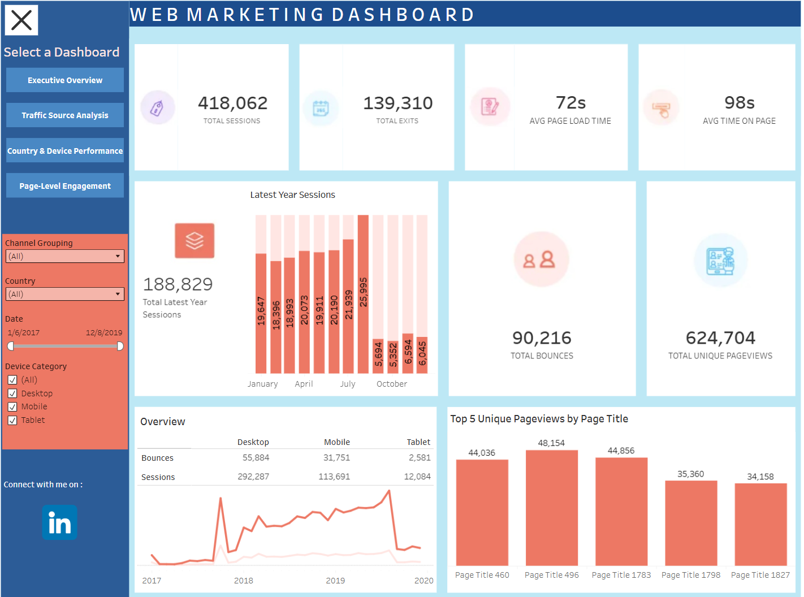
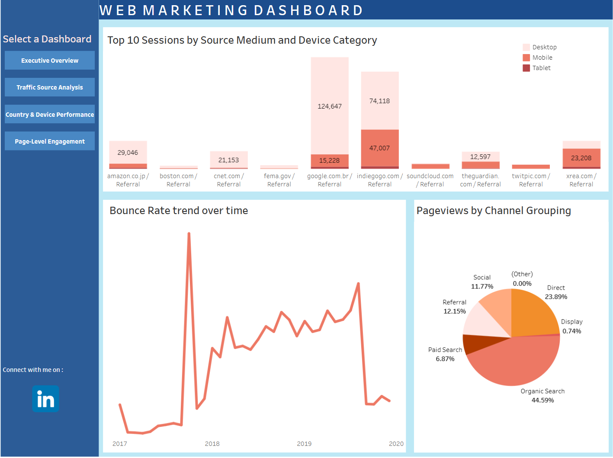
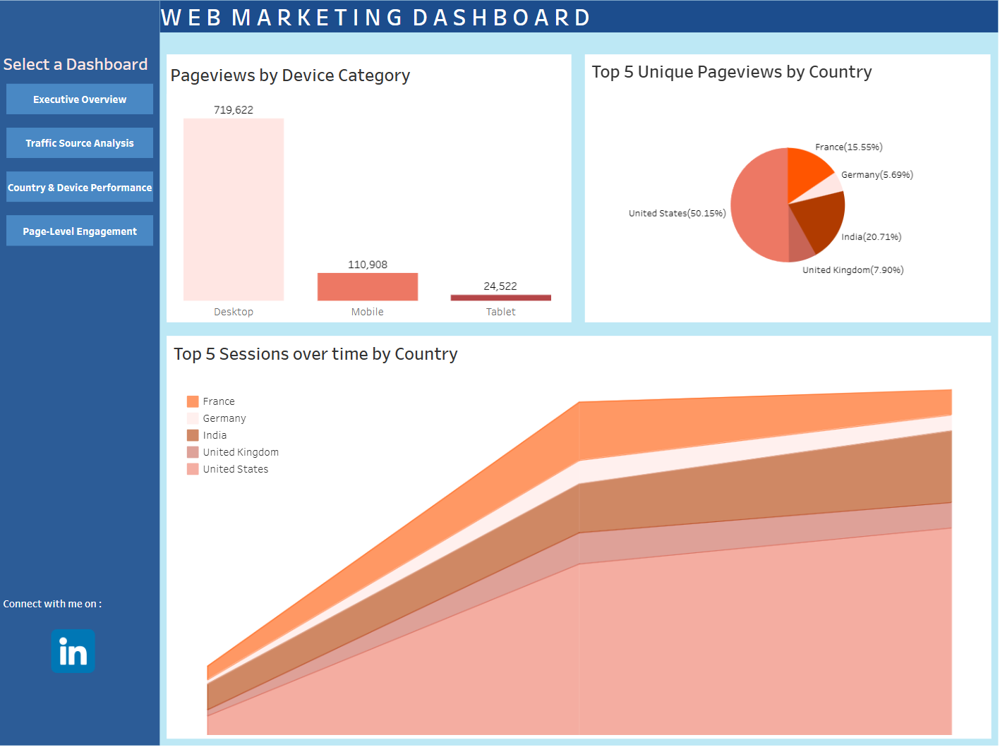
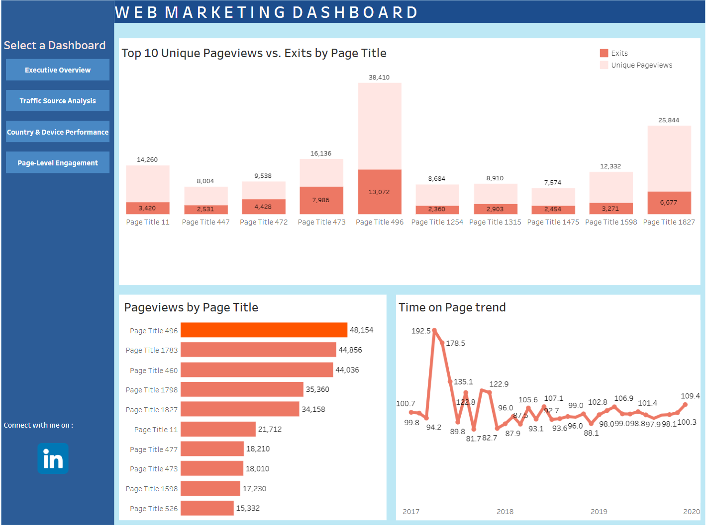

# 📊 Web Marketing Dashboard – Traffic, Engagement & Performance Analysis

_A multi-stakeholder Tableau dashboard consolidating web traffic, content engagement, and channel performance to enable data-driven digital marketing decisions._

---

## 📌 Table of Contents
- [Overview](#overview)
- [Business Problem](#business-problem)
- [Stakeholders](#stakeholders)
- [Dataset & KPIs](#dataset--kpis)
- [Tools & Technologies](#tools--technologies)
- [Project Structure](#project-structure)
- [Process Followed](#process-followed)
- [Dashboard Sheets](#dashboard-sheets)
- [Key Findings – Q&A Analysis](#key-findings--qa-analysis)
- [How to Run This Project](#how-to-run-this-project)
- [Final Recommendations](#final-recommendations)
- [Conclusion](#conclusion)
- [Author & Contact](#author--contact)

---

<h2><a class="anchor" id="overview"></a>Overview</h2>

This project delivers a consolidated, interactive Tableau dashboard designed to give marketing, content, SEO, and regional stakeholders a unified view of web performance. It covers traffic acquisition by source, page-level user engagement, device and geographic segmentation, and bounce rate trends — all structured to support fast, confident decision-making.

---

<h2><a class="anchor" id="business-problem"></a>Business Problem</h2>

In the modern digital ecosystem, web performance data is often fragmented across multiple sources and channels. Without a consolidated view, key questions go unanswered:

- Which traffic channels are truly driving value?
- Which pages engage users and which cause drop-offs?
- How does performance vary across regions and devices?
- Where should marketing budgets be reallocated?

This dashboard bridges that gap — turning raw session data into structured, visual insight across four key analytical perspectives.

---

<h2><a class="anchor" id="stakeholders"></a>👥 Stakeholders</h2>

The dashboard was designed to serve four primary stakeholders:

| Stakeholder | Primary Focus |
|---|---|
| **Marketing Manager** | Campaign ROI, channel performance, bounce rate trends |
| **Content Strategist** | Page-level engagement, time on page, exit analysis |
| **SEO Analyst** | Organic traffic share, source/medium breakdown, keyword performance |
| **Country Manager** | Regional traffic, device category splits, geographic engagement |

---

<h2><a class="anchor" id="dataset--kpis"></a>📊 Dataset & KPIs</h2>

The dashboard is anchored on five core web metrics:

| KPI | Description | Example Value |
|---|---|---|
| **Sessions** | Total number of user sessions | 124,647 from Google Organic |
| **Unique Pageviews** | Sessions where a page was viewed at least once | 38,410 for Page Title 496 |
| **Bounces / Bounce Rate** | Users who left without further interaction | 21.57% overall |
| **Average Time on Page** | Proxy for content engagement | 98 seconds average; peak 254.5s |
| **Exits / Exit Rate** | Sessions ending on a specific page | 7,986 exits (16.26%) for Page Title 473 |

---

<h2><a class="anchor" id="tools--technologies"></a>🛠 Tools & Technologies</h2>

- **Tableau** – Interactive dashboard design and KPI visualization
- **Microsoft Excel** – Data cleaning, column type correction, and date format standardization
- **Microsoft PowerPoint** – Stakeholder presentation of insights and recommendations
- **Microsoft Word** – Methodology documentation and strategic write-up

**Skills Applied:**
- Data Cleaning (changing column data types, fixing date formats using locale settings)
- KPI Selection & Metric Framework Design
- Multi-Sheet Dashboard Architecture
- Stakeholder-Aligned Data Visualization

---

<h2><a class="anchor" id="project-structure"></a>📁 Project Structure</h2>

```
web-marketing-tableau-dashboard/
│
├── README.md                             # Project Document
├── .gitignore
├── web_marketing_dashboard_ppt.pptx          # Presentation
├── web_marketing_dashboard_report_pdf.pdf    # Full Methodology 
│
├── data/         
│   └── web_marketing_dataset.csv         # Source dataset
│   
├── images
│   ├── page_level_engagement
│   ├── country_&_device_performance
│   ├── traffic_source_analysis
│   ├── executive_overview
│
├── dashboard
│   └── Web-Marketing-Tableau-Dashboard.twbx    # Tableau Packaged Workbook
```

---

<h2><a class="anchor" id="process-followed"></a>🔄 Process Followed</h2>

The project followed a structured four-step workflow:

1. **Metric Selection** – Identified core KPIs (Sessions, Pageviews, Unique Pageviews, Bounces, Time on Page) based on relevance to user engagement and marketing performance.

2. **Dashboard Sheet Creation** – Designed four focused analytical sheets, each mapped to a specific stakeholder need and analytical perspective.

3. **Chart Variety** – Used bar charts, line graphs, area charts, pie charts, and stacked bar charts — each selected for its ability to surface specific insights clearly.

4. **Stakeholder Alignment** – Ensured each sheet answers a distinct set of business questions: executives need high-level KPI cards; analysts need granular traffic and page-level breakdowns.

---

<h2><a class="anchor" id="dashboard-sheets"></a>🖼 Dashboard Sheets</h2>

### 1. Executive Overview
Provides a high-level summary of KPIs — sessions, pageviews, bounce rate, and time on page — designed for quick executive assessment of overall web performance.

> 

---

### 2. Traffic Source Analysis
Visualizes sessions by source/medium and device category. Highlights top-performing channels and referral sources. Includes bounce rate trend lines to assess campaign effectiveness.

> 

---

### 3. Country & Device Performance
Compares engagement metrics across countries and device categories using pie and area charts to surface regional and platform-specific trends.

> 

---

### 4. Page-Level Engagement
Displays exits, unique pageviews, and time on page by individual page titles — enabling content strategists to identify high-performing and underperforming pages.

> 

---

<h2><a class="anchor" id="key-findings--qa-analysis"></a>❓ Key Findings – Q&A Analysis</h2>

**Q1: What is the overall bounce rate and what does it indicate?**  
The bounce rate is **21.57%**, indicating that the majority of users engage beyond the landing page — a sign of strong content relevance and site usability.

**Q2: How does average time on page reflect user engagement?**  
With an average of **98 seconds** on page, users are meaningfully consuming content, validating the effectiveness of page layout and content quality.

**Q3: Which source/medium drives the most sessions?**  
**Google Search** leads all sources with **124,647 sessions**, reflecting strong SEO performance and high organic visibility.

**Q4: How do bounce rates vary across traffic sources?**  
Referral traffic from **indiegogo.com** shows a higher bounce rate compared to organic sources, indicating that some referral campaigns may need landing page or UX optimization.

**Q5: Which country shows the highest engagement?**  
The **United States** accounts for nearly **50% of unique pageviews** and leads in session volume, signalling strong regional relevance and targeting effectiveness.

**Q6: What device category dominates traffic?**  
**Desktop users** represent over **70% of total sessions**, confirming that desktop optimization remains the top priority.

**Q7: Which pages have the highest exit rates?**  
**Page Title 473** (16.26%) and **Page Title 472** (9.02%) show elevated exit rates, signalling potential issues with content relevance or user flow continuity.

**Q8: Which pages demonstrate the strongest engagement?**  
**Page Title 496** leads in both unique pageviews and time on page, indicating highly engaging, well-structured content worth replicating.

---

<h2><a class="anchor" id="how-to-run-this-project"></a>▶️ How to Run This Project</h2>

1. **Clone the repository:**
```bash
git clone https://github.com/yourusername/web-marketing-tableau-dashboard.git
```

2. **Review the dataset:**
   - Open `data/web_marketing_dataset.xlsx` in Microsoft Excel
   - The file contains the cleaned web analytics data used as the Tableau data source

3. **Open the Tableau Dashboard:**
   - Open `dashboard/Web-Marketing-Tableau-Dashboard.twbx` in **Tableau Desktop** or **Tableau Public**
   - The `.twbx` packaged workbook includes the data source, so no additional connection setup is needed

4. **Explore the four dashboard sheets:**
   - Navigate between sheets using the tabs at the bottom: *Executive Overview*, *Traffic Source Analysis*, *Country & Device Performance*, and *Page-Level Engagement*
   - Use built-in Tableau filters to slice data by date, source/medium, country, or device category

5. **Review supporting documents:**
   - Open `web_marketing_dashboard_ppt.pptx` for the presentation.
   - Open `web_marketing_dashboard_report.docx` for the full methodology and findings report

> **Requirements:** Tableau Desktop 2021.1+ or Tableau Public (free). Microsoft Excel for data file. Microsoft Office for PPT and Word files.

---

<h2><a class="anchor" id="final-recommendations"></a>✅ Final Recommendations</h2>

- **Budget Reallocation**: Prioritize Google Organic Search investment to maximize ROI. Monitor bounce rate trends continuously to catch campaign weaknesses early.

- **Content Optimization**: Redesign high-exit pages (Title 473, 472) to improve user retention. Replicate the content format and structure of high-performers like Page Title 496 across other pages. Use A/B testing to validate improvements.

- **SEO Strategy**: Refine keyword targeting using bounce and exit data as signals. Focus on technical SEO improvements to sustain and grow organic search rankings.

- **Localization**: Deepen content localization for high-engagement markets (United States, India). Explore emerging market opportunities by tailoring campaigns to local preferences.

- **Mobile Optimization**: Enhance mobile experience even though desktop dominates — mobile share presents a growth opportunity. Use dashboard filters to run regular device-specific performance reviews.

- **Referral Campaign Review**: Reassess referral partners with high bounce rates. Optimize landing pages specifically for referral-driven traffic to reduce drop-off.

---

<h2><a class="anchor" id="conclusion"></a>📝 Conclusion</h2>

This project demonstrates the strategic value of consolidated web marketing dashboards in enabling faster, smarter decision-making. By unifying sessions, engagement, and channel data into a single interactive Tableau workbook, this dashboard empowers each stakeholder — from executives to content teams — to act on clear, contextual insights rather than raw numbers.

---

<h2><a class="anchor" id="author--contact"></a>👤 Author & Contact</h2>

**Rashmin Solanki**  
Data Analyst  
📧 Email: rashminslnk77@gmail.com  
🔗 [LinkedIn](www.linkedin.com/in/rashmin-solanki)      
🔗 [GitHub](https://github.com/rashminslnk)
